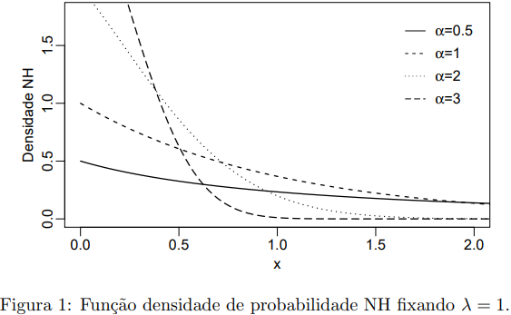
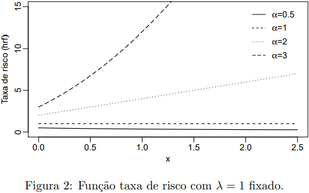
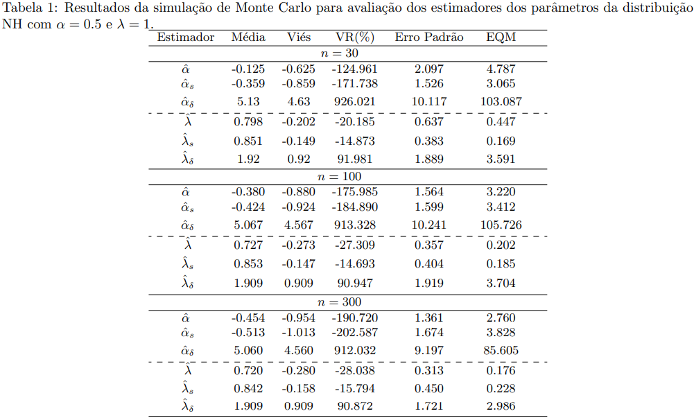
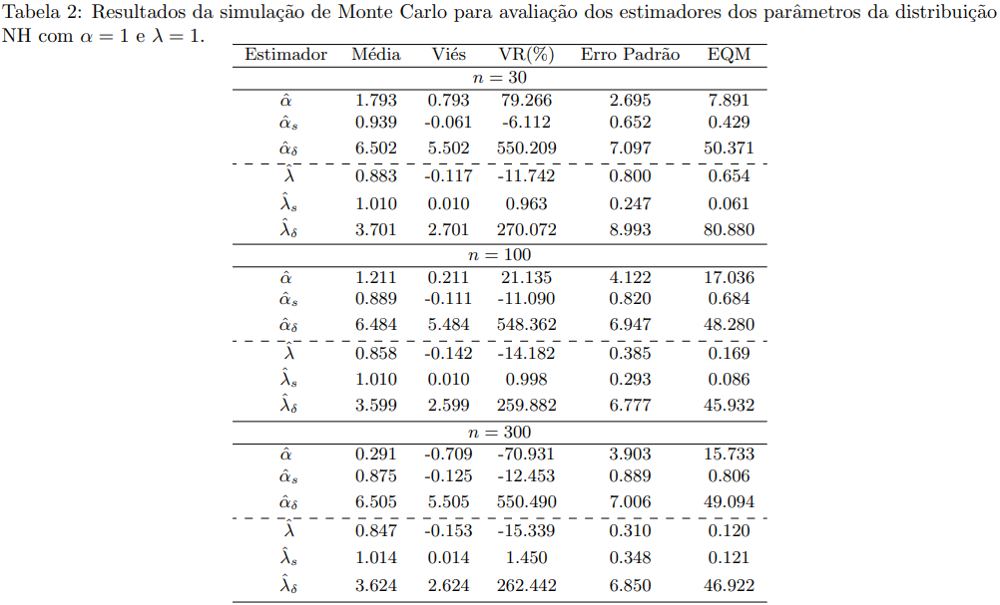
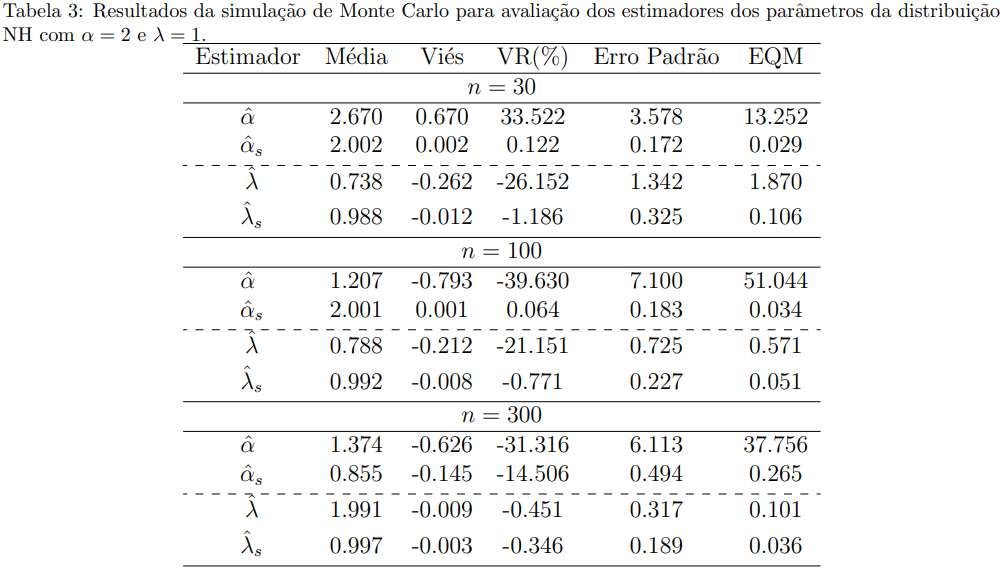
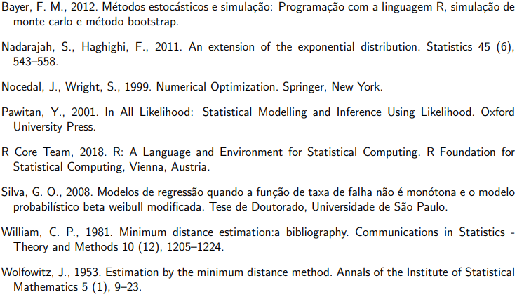

# Estimação dos paramêtros da distribuição NadaraJah-Naghighi
#### Objetiva-se avaliar numericamente estimadores da distribuição Nadarajah-Naghighi por meio de simulações de Monte Carlo. 

### 1. Introdução
O presente estudo aborda principalmente distribuições da área de sobrevivência. De forma geral, a literatura define como o tempo até a ocorrência de um evento (descrito por uma variável resposta) denota-se por tempo de sobrevivência ou tempo de falha e o conjunto de observações são os dados de sobrevivência.
Estes possuem suporte apenas nos reais positivos, e portanto, a distribuição normal não se caracteriza como adequada para descrevê-los.

A distribuição exponencial é amplamente empregada para problemas de análise de sobrevivência (área da saúde) ou confiabilidade (pesquisa industrial). Por exemplo, possui extensa aplicação na modelagem do tempo de vida de diversos produtos e materiais.	O foco deste relatório é voltada para a distribuição de Nadarajah-Haghighi (NH), proposta como uma generalização da distribuição exponencial. Sua função densidade de probabilidade é dada por:

$$ g(x)=\alpha \lambda(1+\lambda x)^{\alpha-1} \exp \left[ 1-\left( 1+\lambda x\right) ^\lambda\right], \quad \lambda>0,\quad \alpha>0, $$

em que $\lambda$ é o parâmetro de escala e $\alpha$ representa o parâmetro de forma. Quando $\alpha=1$  temos o caso particular da distribuição NH  equivalente à distribuição exponencial. 
A Figura 1 apresenta diferentes densidades da distribuição NH ao variar o parâmetro da forma $\alpha$ e manter $\lambda=1$.

<!---  --->

  

A função distribuição acumulada é dada por:

$$ G(x)=1-\exp \left[ 1-(1+\lambda x)^\alpha \right]. $$

A função de taxa de risco ou taxa de falha é uma quantidade que caracteriza o comportamento da sobrevivência até um determinando tempo. Em geral, a taxa de falha pode possuir um crescimento ou decrescimento não-monótono. 	Analisando-a pode-se definir o modelo probabilístico mais adequado para modelar o tempo de sobrevivência.	 Destaca-se que a distribuição NH é capaz de modelar dados que possuem taxas de falha não-monótonas independente da variação da densidade da distribuição. Este é um importante diferencial sob distribuições usuais em análise de sobrevivência como gama, Weibull e exponencial exponencializada que apenas acomodam taxas de falhas crescentes/decrescentes quando sua respectiva densidade estão diminuindo monotonicamente.	 
	A taxa de risco para a distribuição NH é expressa por: 
  
  $$ 	h(x) = \alpha \lambda (1+\lambda x)^{\alpha-1}. $$
  
  Generalizando uma distribuição é possível obter uma função de falha mais flexível, podendo ser constante, decrescente, crescente, em forma da banheira e banheira invertida, a depender dos valores dos parâmetros.  Analogamente aos formatos da densidade NH, apresentamos com mesmos parâmetros,  as formas da taxa de risco para a NH visualizadas na Figura 2.
  
 

  

 
  O presente trabalho visa uma avaliação numérica dos EMV (Estimadores de Máxima Verossimilhança) $\hat{\alpha}$ e $\hat{\lambda}$ da distribuição NH, via simulação Monte Carlo. O comportamento e desempenho dos EMV será comparado sob amostras de tamanho finito e sob a inclusão do vetor escore com primeiras derivadas analíticas no processo de otimização de máxima verossimilhança, os quais serão denotados por $\hat{\alpha}_s$ e $\hat{\lambda}_s$.

### 2. Estimação Pontual

#### 2.1 Estimador de Máxima Verossimilhança (EMV)

O método de máxima verossimilhança é o método mais popular para estimação de parâmetros, sendo amplamente explorado na literatura \cite{Pawitan2001}. Seja $\mathbf{x}=(x_1,x_2,\ldots,x_n)$ uma amostra observada $\sim NH(\alpha, \lambda)$, sendo $n$ o tamanho amostral, a função de verossimilhança para os parâmetros $\alpha$ e $\lambda$ é definida por:

$$
	L(\alpha,\lambda;\mathbf{x}) = \prod_{i=1}^{n} g(x_i;\alpha,\lambda) = \prod_{i=1}^{n} \alpha \lambda(1+\lambda x_i)^{\alpha-1} \exp \left[ 1-\left( 1+\lambda x_i\right) ^\lambda\right]. $$
	
Tomando o logaritmo da função de verossimilhança, temos a função de log-verossimilhança, dada por:

$$
\ell (\alpha,\lambda;\mathbf{x}) = \sum_{i=1}^{n} \log \left[ g(x_i;\alpha,\lambda) \right] = \sum_{i=1}^{n} \ell_i(x_i;\alpha,\lambda),
$$

em que

$$ \ell_i(x_i;\alpha,\lambda) = n + n\log(\alpha \lambda) + (\alpha-1) \log(1+
	\lambda x_i) - \sum_{i=1}^n (1+\lambda x_i)^\alpha. $$
	
Os estimadores de máxima verossimilhança são os valores $\hat{\alpha}$ e $\hat{\lambda}$ que maximizam a função de verossimilhança, ou, equivalentemente, a função de log-verossimilhança. 
Para obtenção dos estimadores, 
	deriva-se a log-verossimilhança em relação a cada um dos parâmetros e iguala-se a zero. Como expresso a seguir:
	
$$ \frac{n}{\alpha} + \sum_{i=1}^{n} \log(1+\lambda x_i) - \sum_{i=1}^{n} (1+\lambda x_i)^\alpha \log(1+\lambda x_i) = 0 $$

e

$$ \frac{n}{\lambda}+ (\alpha-1) \sum_{i=1}^{n} x_i(1+\lambda x_i)^{-1} - \alpha \sum_{i=1}^{n} x_i (1+\lambda x_i)^{\alpha-1}. $$

Contudo, a solução desse sistema não possui forma fechada. Devido a isso, são considerados métodos numéricos para maximização da função de log-verossimilhança. 

#### 2.2 Estimador de Mínima Distância (EMD)
A distância mínima é definida como um método de estimação geral desenvolvida por Wolfowitz (1953). A idéia principal se baseia em fazer com que a função de distribuição assumida avaliada nas estimativas esteja mais próxima da função de distribuição empírica das variáveis observadas. A função de distribuição empírica é dada por:

$$
G_n(x) = \frac{1}{n} \sum_{i=1}^n ~ \mathrm{I} (X_i \leqslant x),
$$

em que $\mathrm{I}$ é a função indicadora. 
A minimização da distância entre a função de distribuição empírica $G_n$ e a função de distribuição estimada $G_{\hat{\theta}}$, produz estimadores com propriedades de robustez e consistência. Neste relatório, $\theta$ são os parâmetros $\alpha$ e $\lambda$ da distribuição NH e $G_\theta(x)$ é a função distribuição acumulada da NH.
O método pode ser aplicado com diversas medidas de distância. Consideramos a distância de Kolmogorov-Smirnov (KS) dada por:

$$
\delta_{KS} (G_n, G_{\hat{\theta}}) = sup_{x} \mid G_n(x) - G_{\hat{\theta}}(x) \mid.
$$

 A distância KS mede a máxima discrepância absoluta entre a função de distribuição empírica da amostra $G_n(x)$ e a função de distribuição acumulada estimada $G_{\hat{\theta}}(x)$ da distribuição beta. Os valores de $\theta$ que minimizam a discrepância das distribuições $(F_n,F_\theta)$, ou seja, os estimadores de mínima distância, serão denotados por  $\hat{\alpha}_\delta$ 
 e  
 
 $\hat{\lambda}_\delta$.

 
### 3. Método de Monte Carlo

Simulações de Monte Carlo são baseadas na Lei dos Grandes Números, proposta por Bernoulli. Se fundamenta em  experimentos independentes realizados repetidamente. Supondo $p$ uma probabilidade de sucesso, temos que sob um número de repetições arbitrariamente grande, o experimento convergirá exatamente para $p$. A usual aplicação de Monte Carlo em estatística se dá na avaliação de estimadores em casos que a determinação analítica de propriedades como viés, erro padrão e EQM são impossíveis ou muito custosas. Também, no caso de analisar o comportamento dos estimadores em amostras finitas, mesmo já tendo conhecimento de suas propriedades assintóticas.
Um algoritmo completo sobre o funcionamento de simulações de Monte Carlo, dado por:
1. Atribua um determinado valor ao seu parâmetro e determinar um tamanho amostral $n$ de interesse;
2. Gere uma ocorrência de uma amostra aleatória de tamanho n, seguindo a distribuição teórica de interesse indexada pelo parâmetro $\theta$ fixado;
3. Baseando-se na amostra simulada, determinar uma estimativa para $\hat{\theta_k}$ do estimador $\hat{\theta}$. Guardar este valor de $\hat{\theta_k}$;
4. Repita os dois passos (2) e (3) anteriores um número R muito grande de vezes, ou seja, obtenha $\hat{\theta_k},$ com $k = 1, \ldots, R $;
5. Baseado no vetor com R réplicas de Monte Carlo do estimador $\hat{\theta}$ calcule as medidas descritivas de interesse, como, por exemplo: média, variância, desvio-padrão, coeficientes de assimetria e curtose, etc. Perceba que se $R$ for grande o suficiente, a Lei dos Grandes Números nos garante que essas medidas serão a média, variância, erro-padrão, etc, do estimador $\hat{\theta}$;
6. Como o valor de $\theta$ é conhecido, pois inicialmente atribuímos um valor a ele, então sabemos avaliar o viés do estimador, assim como o EQM.

### 4. Avaliação Numérica
Um estudo de simulações de Monte Carlo é apresentado para avaliar numericamente os EMV dos parâmetros da distribuição NH. Foram consideradas 50000 réplicas de Monte Carlo para cada cenário com tamanhos amostrais $n=30, 100, 300$. Em cada réplica, foram geradas $n$ ocorrências da variável $x \sim NH(\alpha,\lambda)$ pelo método da inversão.

As medidas estatísticas calculadas foram: média, viés, viés relativo percentual (VR), erro padrão e erro quadrático médio (EQM). As implementações computacionais foram desenvolvidas em linguagem R. Nos procedimentos de maximização das funções de log-verossimilhança condicionais foi utilizado o método quasi-Newton BFGS  com primeiras derivadas analíticas. O algoritmo de otimização exige valores iniciais definidos como seus respectivos valores verdadeiros. A escolha dos cenários foi feita fixamos o valor do parâmetro de escala $\lambda=1$ e variamos o parâmetro de forma $\alpha=0.5, 1, 2, 3.$ Os resultados são apresentados nas Tabelas 1, 2 e 3.

  

  

  

### 5. Conclusões

Na Tabela 1, o parâmetro de forma é definido igual a $\alpha=0.5$, há evidentes distorções inferenciais, principalmente nas estimativas referentes ao $\alpha$. O VR do mesmo se mantém alto em todos tamanhos amostrais. O EMD denotado por $\hat{\alpha}_\delta$ e $\hat{\lambda}_\delta$ se mostrou altamente viesado na estimação do parâmetro de forma. Os EMVs com e sem o escore analítico possuem resultados numéricos semelhantes. Comparativamente aos outros cenários, este classifica-se como o pior.
		
A Tabela 2 apresenta estimadores razoáveis se tratando do método de máxima verossimilhança. Neste cenário, $\alpha=1$ e $\lambda=1$ é evidente a superioridade do EMV considerando primeira derivada analítica para convergência. Por exemplo, para tamanho amostral $n=30$ temos que VR de $\hat{\alpha}=79.27$ enquanto VR de $\hat{\alpha}_\delta=-6.11$. De forma geral, verifica-se que as estimativas para os parâmetros melhoram com o aumento amostral. Com exceção do EMD, as medidas apresentam consistência quando $n$ cresce. Observa-se que os valores do parâmetro de escala são na maioria dos casos menos viesados que os parâmetros de forma. Já na Tabela 3, descartamos o uso do EMD, pois apresentou problemas de convergência numérica. Porém, para os EMVs, percebe-se analogamente à Tabela 2, uma expressiva superioridade do EMV com primeiras derivadas numéricas em relação ao gradiente. Exemplificando, para um $n=100$ temos VR de $\hat{\lambda}$ igual a $-21.15$, enquanto que para sua versão com escore $\hat{\lambda}_s = -0.77$. Salienta-se o problema de máximos locais durante a otimização, que geraram isoladamente estimativas para os parâmetros fora de contexto e ocasionaram em distorções, principalmente para o EMD que não apresentou adequabilidade nessa circunstância.
	
De acordo com os resultados, podemos concluir que o estimador com desempenho superior comparativamente aos demais é o EMV com primeiras derivadas numéricas, como esperado. 

### Referências

  

